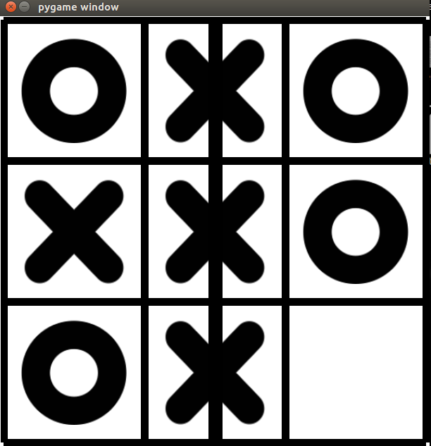

# Tic-Tac-Toe

The classic tic-tac-toe game using pygame.

## How to play

1. Download the repository
2. 

## Screenshot

## Versioning

Version 1.0

## Authors

Anil Sathyan

## Acknowledgements
* "https://medium.com/tensorflow/train-on-google-colab-and-run-on-the-browser-a-case-study-8a45f9b1474e"
* "https://github.com/tensorflow/examples/tree/master/lite/examples/image_classification/android"
* "https://guides.codepath.com/android/Basic-Painting-with-Views"
